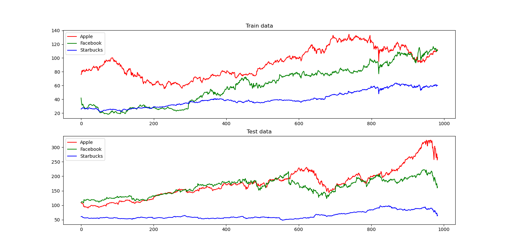

# RL_stocks

Q-learning Agent that tries increase it's profit by buying/selling stocks from different companies.

Simple rule for buying : keep x% of your total current amount, and use (1-x)% to buy the stocks that the agent decides to (buys as much as he can).

Simple rule for selling: if the agent decides that the owned shares from a company should be sold (i.e. decides the action **sell** for stock **x**) it sells all owned shares from that company

**Example :**

Using the stock prices from Facebook, Starbucks and Apple we get the following **training** and **testing** data (which were obtained by taking the first, respectively last half of the full price list):

The agent was trained on 30 episodes using the training data, and exponential decay for the **epsilon parameter**, which determines the probability that our agent will do a random action (exploring starts, exploiting ends). I've trained a simple linear model with Keras to make it output the Q-value for each state, which was used to select the **best action** (the possible actions for a stock can be: buy, sell, hold).

For performance analysis, I've used the test data in 2 different cases: when the agent is mostly doing what our previously learned model decides (epsilon=0.1) vs. when the agent acts randomly, completly ignoring the Q function approximator (epsilon=1). The corresponding histograms for the final amount of money the agent has after testing it 30 times on the test data are shown below:

As you can see, the histogram for the random-agent is more spreaded across x-axis, and more important, it sometimes leads the agent to a **worse state** than the initial one (final cash < 2000). This is not the case for the agent that uses a learned model from training data, which has a smaller spread, but doesn't lead the agent to a worse state.

There are certainly a lot more things which could be improved for this whole project, like:
* strategies for buying and selling
* the model used to learn the Q function
* state modeling - more parameteres could be taken into account when deciding wether to buy, sell or hold

These topics will be discussed in future work.
